# Data Analysis, Modeling and Algorithms
# Author: Shaarang Buckal

## Background
Statistics aids human in revealing latent pattern in the data. We used K-means clustering to segregate TripAdvisor reviewers based on their reviews related to Sports and Religion events and trips.	

## Data Source
The dataset is fetched from TripAdvisor, for 249 high volume reviewers and their reviews in six categories. We will choose only two categories as mentioned above. 

## Data Transformation and Cleaning (Description)
The User_ID column was removed as it is simply noise for the model.
No other explicit data transformation was required.
We normalized all the features so that their respective data points are compatible with the clustering model and there is a common scale among all the features for comparison.
I normalized features by subtracting the minimum value of a feature from each of its respective data points and dividing the results by the margin of the corresponding feature
norm01 <- function(x) {return ((x - min(x)) / (max(x) - min(x)))} 

## Descriptive Data Analysis

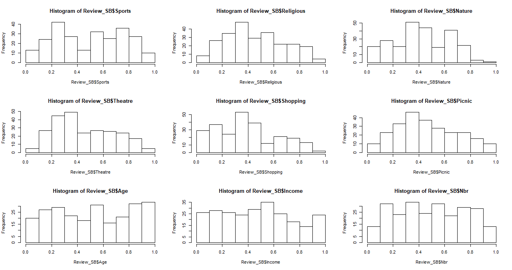

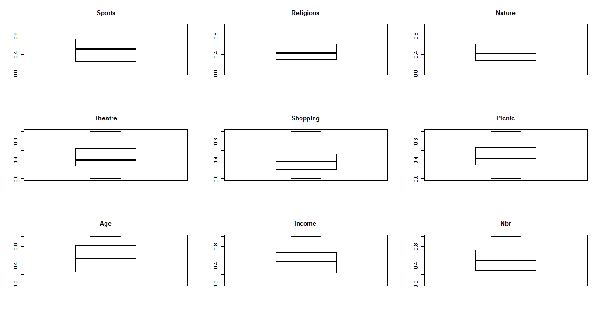

The graphical summary provides enough evidence on the absence of any outliers.
The histogram displays the features are approximately distributed normally.

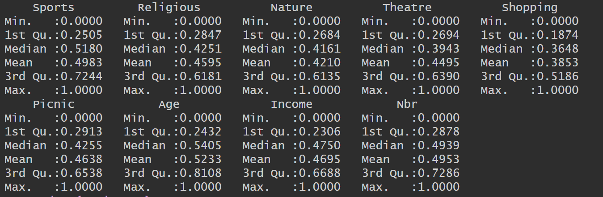

The numerical summary confirms the claim that the features are normally distributed. We can see that all the features have their data points symmetrically spread around the mean, the mean value in turn is in proximity of 0.5 for all the features.

# Segmentation Scheme

### For K=2

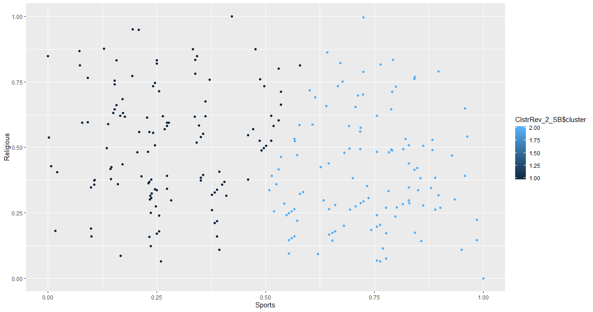

##### Within cluster sum of squares=294

### For K=3

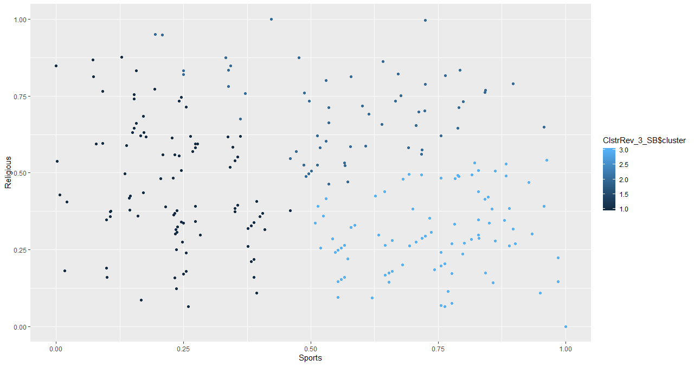

##### Within cluster sum of squares =182

### For k=4

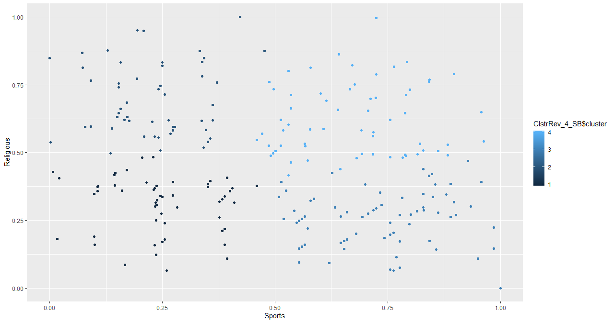

##### Within clusters sum of squares= 121

### For K=5

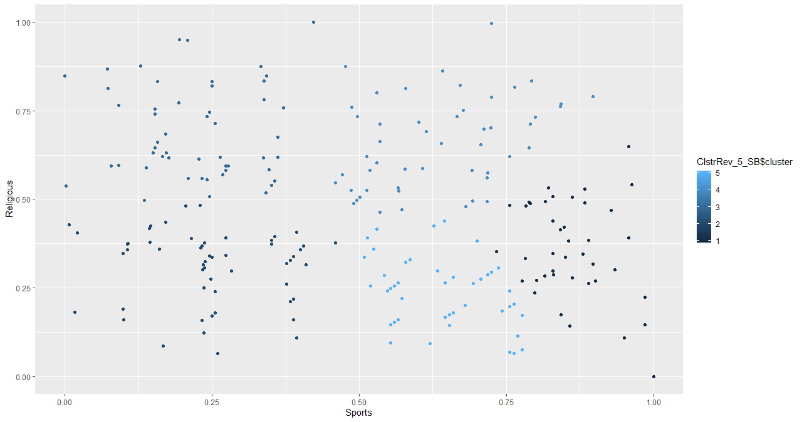

##### Within clusters sum of squares= 99.8

### For K=6

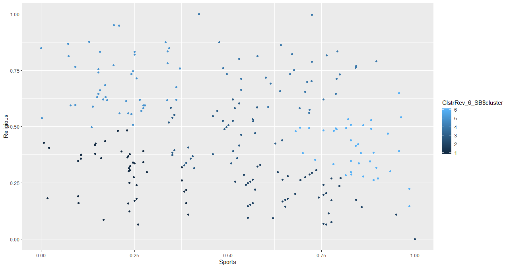

##### Within clusters sum of squares = 85

The within clusters sum of squares measures the density of the packing of the clusters, ideally, we want densely packed clusters i.e. lower value for the within clusters sum of squares. Although K=6 gives the lowest value, the plot does not highlight prominently separating clusters. We should not abuse the parameter to forcefully expose clusters that do not exists. Hence an optimal combination of the scatterplot and the within cluster sum of squares provides the best segmentation scheme.
We will outrightly discard K=5 and K=6. The scatter plot for K=2 does not bifurcates the clusters aesthetically and the within cluster sum of squares is very high. 
In order to decide among K=3 and K=4, we will bring the Elbow plot into play. 

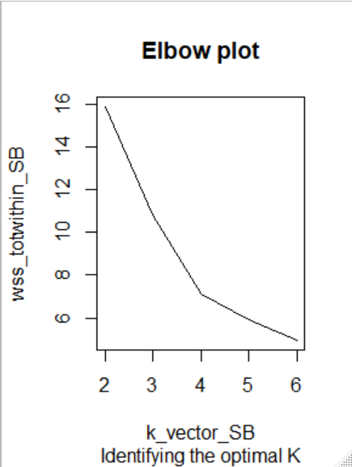

The total within sum of squares significantly decreases from K=3 to K=4, which suggests that K=4 is the better value. The comparison of scatter plot for the two K values also leans towards K=4. The data points seem to be separated into imaginary quadrants. 
So, we select K=4 as our optimal solution.
Note :  Strong arguments could be made about K=3 value also. Between K=3 and K=4 there is no wrong answer. Also, with different model hyperparameters such as iter.max and nstart we could converge to different solution.

### Evaluation of Clusters

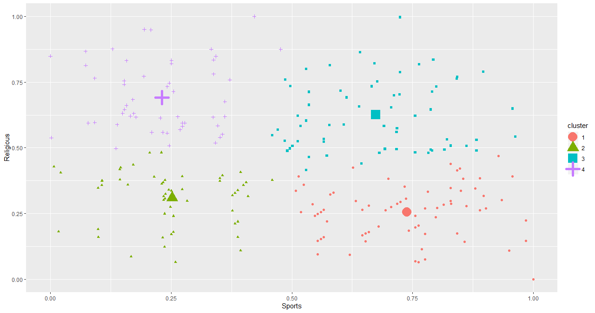

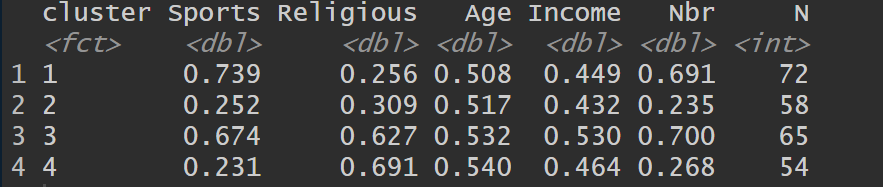

The reviewers are categorized into four clusters. Each cluster aesthetically behaves as a quadrants, where Sports and Religion takes the roles of X and Y axis, a new cartesian plane to define the behaviour of reviewers is generated, cheers.
The reviewers in Cluster 1 are clearly ‘Sports Fanatics ’ with least inclination towards religious reviews, it is not surprising that reviewers in this cluster are the youngest. The age matches their degree of inclination towards complex beliefs such as Religion. I call them the Hooligans.
The reviewers in cluster 2 are less interested in sports events/trips and also ambivalent towards their religious reviews. This is the sparsest cluster in terms of number of reviews. I call them the Safe betters.

The cluster 3 holds the most active and dynamic reviewers, evident from the highest number of reviews across all clusters. Also, these people are equally interested in both sports events as well as pilgrimages, it would be expected considering this cluster has the most affluent reviewers. Apparently, money takes you around the globe, at least for this bunch. I call them the Fat Cats.
The cluster 4 comprises some of the most religious reviewers who consistently takes pilgrimage to their Holy land. I shall call them the Pilgrims.

The above Segmentation scheme can be very effective financially. This is the holy grail for travel agents.
You have an economical trip to religious or spiritual event (although in my opinion religion is the debris of spirituality), approach reviewers from the cluster 4.
You have an exciting euro travel plan, cluster 3 is where all the affluent ones are.
Any sports event coming up, direct all your ticket advertisement to the customers from cluster 1.
The behaviour of cluster 2 customers is ambiguous, a safe bet is to advertise them any product.
